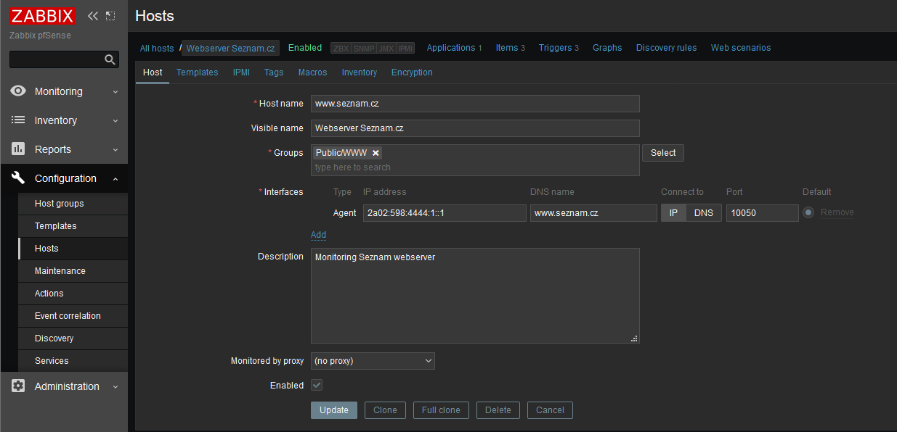

## zabbix-ansible

First steps with Ansible and Zabbix collections on FreeBSD 12.2, Ubuntu 20.04, CentOS 7.9

### Packages FreeBSD

- Package - py37-pip-20.2.3		Tool for installing and managing Python packages
- Package - py37-ansible-2.9.7		Radically simple IT automation

### Packages Ubuntu

- Package - ansible			2.9.6+dfsg-1
- Package - python-pip			20.0.2-5ubuntu1.1

### Packages CentOS

- Package - ansible			2.9.18-1.el7.noarch	
- Package - python2-pip			8.1.2-14.el7.noarch

### How it works

Ansible use collections https://galaxy.ansible.com/community/zabbix and by
Zabbix API create Host's and Host's Group in Zabbix monitoring system.

### Install FreeBSD

```console
cd /usr/ports/devel/py-pip && make install clean
cd /usr/ports/sysutils/ansible && make install clean

pip install zabbix-api
Collecting zabbix-api
  Downloading zabbix-api-0.5.4.tar.gz (5.6 kB)
Using legacy 'setup.py install' for zabbix-api, since package 'wheel' is not installed.
Installing collected packages: zabbix-api
    Running setup.py install for zabbix-api ... done
Successfully installed zabbix-api-0.5.4
```

### Install Ubuntu

```console
apt install python-pip
apt install ansible

pip3 install zabbix-api
Collecting zabbix-api
  Downloading zabbix-api-0.5.4.tar.gz (5.6 kB)
Building wheels for collected packages: zabbix-api
  Building wheel for zabbix-api (setup.py) ... done
  Created wheel for zabbix-api: filename=zabbix_api-0.5.4-py3-none-any.whl size=5612 sha256=f6903e16d4c89c507ee4cd8d8d70447a563731a89de33072799ed5d89f135343
  Stored in directory: /root/.cache/pip/wheels/a4/96/9f/c842db4c072e03fb30233828f7fceef11a92450964261de964
Successfully built zabbix-api
Installing collected packages: zabbix-api
Successfully installed zabbix-api-0.5.4
```

### Install CentOS
```console
yum install ansible
yum install python-pip

pip3 install zabbix-api
Collecting zabbix-api
  Downloading https://files.pythonhosted.org/packages/e3/ed/2092731880f0de5b07067fc446dc0fc5166f2ee98018b6d524cd3e28a69d/zabbix-api-0.5.4.tar.gz
Installing collected packages: zabbix-api
  Running setup.py install for zabbix-api ... done
Successfully installed zabbix-api-0.5.4
```

### Install ansible collection zabbix

```console
ansible-galaxy collection install -r requirements.yml
Process install dependency map
Starting collection install process
Installing 'community.zabbix:1.3.0' to '/root/.ansible/collections/ansible_collections/community/zabbix'
```

### Run playbook
```console
export ZABBIX_USER=zabbix_admin_user
export ZABBIX_PASSWORD=*******************

ansible-playbook setup_zabbix_server.yml 
PLAY [Using Zabbix collection] *********************************************************************************

TASK [Gathering Facts] *****************************************************************************************
ok: [localhost]
- Import Media
TASK [include_tasks] *******************************************************************************************
included: /work/zabbix-ansible/tasks/zabbix-add-host-group.yml for localhost

TASK [Create host groups] **************************************************************************************
ok: [localhost]

TASK [include_tasks] *******************************************************************************************
included: /work/zabbix-ansible/tasks/zabbix-add-host-freebsd.yml for localhost

TASK [Create a FreeBSD host or update] *************************************************************************
ok: [localhost]

TASK [include_tasks] *******************************************************************************************
included: /work/zabbix-ansible/tasks/zabbix-add-host-seznam.yml for localhost

TASK [Create a Seznam host or update] **************************************************************************
ok: [localhost]

TASK [include_tasks] *******************************************************************************************
included: /work/zabbix-ansible/tasks/zabbix-add-host-smejdil.yml for localhost

TASK [Create a SmEjDiL host or update] *************************************************************************
ok: [localhost]

TASK [include_tasks] *******************************************************************************************
included: /work/zabbix-ansible/tasks/zabbix-add-screen.yml for localhost

TASK [Create screen Public/WWW-servers or update the existing screen items] ************************************
ok: [localhost]

TASK [include_tasks] *******************************************************************************************
included: /work/zabbix-ansible/tasks/zabbix-add-template.yml for localhost

TASK [Import Zabbix Training from XML] *************************************************************************
ok: [localhost]

TASK [include_tasks] *******************************************************************************************
included: /work/zabbix-ansible/tasks/zabbix-add-user.yml for localhost

TASK [create a new zabbix user.] *******************************************************************************
changed: [localhost]

PLAY RECAP *****************************************************************************************************
localhost                  : ok=15   changed=1    unreachable=0    failed=0    skipped=0    rescued=0    ignored=0
```

### Images



### To do

- Import Media
- Create other Zabbix objects